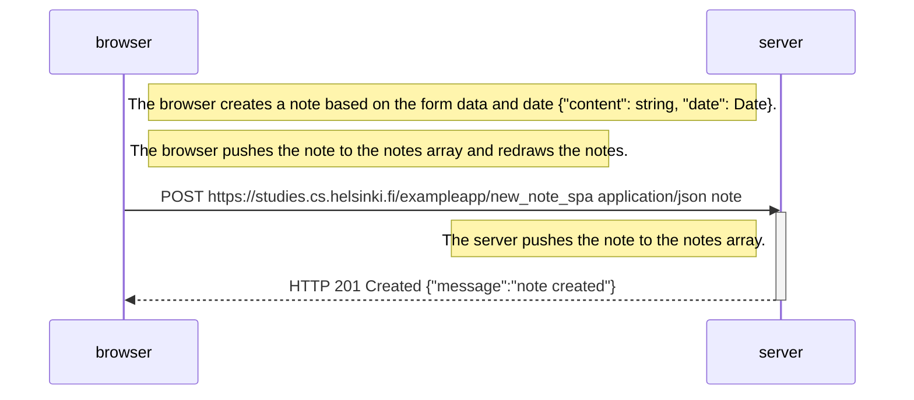

```mermaid
sequenceDiagram
    participant browser
    participant server

    Note right of browser: The browser creates a note based on the form data and date {"content": string, "date": Date}. 
    Note right of browser: The browser pushes the note to the notes array and redraws the notes.

    browser->>server: POST https://studies.cs.helsinki.fi/exampleapp/new_note_spa application/json note
    activate server
    Note left of server: The server pushes the note to the notes array.
    server-->>browser: HTTP 201 Created {"message":"note created"}
    deactivate server
```